<picture>
  <source media="(prefers-color-scheme: dark)" srcset="dark.svg">
  <source media="(prefers-color-scheme: light)" srcset="light.svg">
  
</picture>

<picture>
  <source media="(prefers-color-scheme: dark)" srcset="dark.svg">
  <source media="(prefers-color-scheme: light)" srcset="light.svg">
  
</picture>

<h1 align="center">Hi there, I'm Bahriye 👋</h1>

  Software Engineering student based in Kyrenia, North Cyprus 🇨🇾 — learning and building with modern web technologies.

 

## 🚀 About Me

- 🎓 Studying **Software Engineering**
- 🌱 Currently learning and building projects with **React**, **Node.js** and **PostgreSQL**
- 💬 Ask me about **HTML, CSS, JavaScript, Tailwind CSS**
- 📫 Reach me at **bahriyegezer5@gmail.com**
- ⚡ Fun fact: I like turning ideas into clean, working interfaces

 

## 🛠️ Tech Stack

  
  
  
  
  
  
  
  
  

 

## 📊 GitHub Stats

  
  

  

 

## 🤝 Connect with me

  
  
  

 

  

